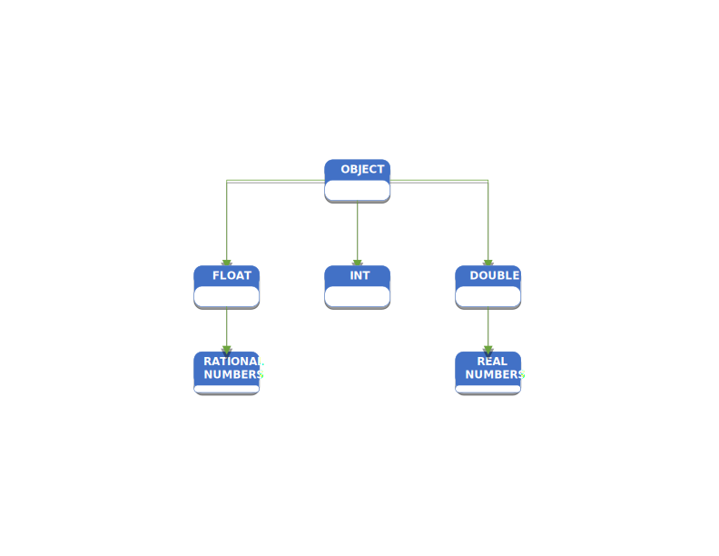

# Polymorphism

> What is polymorphism? If you Google it, you will get some esoteric definition about many-shapes or many-forms, but we need more than the etymology of word to make practicle use of the word. Polymorphism is substituting a base class say `Animal` for a subclass `Cat`. This subtitution allows one `type` to have many shapes: `Cat`, `Dog`, `Bird` etc. I do not know if you caught that I slipped in the word `type`. You see programming is all about types and mappings of types either from a type to itself or from a type to a different type. There are other principles of Programming like state, scope concurrency etc. But those will other posts for the future. The type **`int`** can have only one shape. By this I mean it has a pre-defined size and range of values. That is to say when the compiler reads a declaration of type **`int`** it knows that an **`int`** has only one size in memory, and if the value assigned to the declaration is valid. There is no guessing. So if **`int`** is a type and it can only have one form, it must be static. It cannot change. So types are not polymorphic. But what if we created a type `Whole Number` that sat under the type **`int`** in the type hierarchy. Polymorphism would let us substitute an instance of `Whole Number` where ever **`int`** was present. 

> But what is a hierarchy? And what do they have to do with Polymorphism? As you can see below in the graphic a hierarchy exemplifies a base type; here the base type is `object`. This is common in programming languages. But underneath `object` there are other `types`. These types are called derived types because they are derived from `object`. Lets take a look at an example. 



#### Given two C# classes
```csharp
public interface IAnimal
{

}


public class Animal : IAnimal
{
    public string? Name { get; set; }
    public string? Color { get; set; }

    protected Animal(string name, string color)
    {
        Name = name;
        Color = color;
    }
}

public class Cat : Animal
{
    public string Sound { get; set; }

    public Cat(string name, string color, string sound) : base(name, color)
    {
        Sound = sound;
    }
}

public class Dog : Animal
{
    public string Sound { get; set; }

    public Dog(string name, string color, string sound) : base(name, color)
    {
        Sound = sound;
    }
}
```

#### Then in the Program.cs
```csharp
var cat = new Cat("Jack", "Black", "Meow");
var dog = new Dog("TRex", "White", "Ruff");
GetAnimalName(cat); // "Jack"
GetAnimalName(dog); // Trex

void GetAnimalName(Animal animal)
{
    Console.WriteLine(animal.Name);
}
```

> Notice that `GetAnimalName`'s signature excepted an type of `Animal`. But since `Cat` is also a type of `Animal` polymorphism allows us to substitute `Animal` with `Cat`. This would also work if we used the `Dog` class instead of the `Cat` class. But polymorphism also works with functions and methods too. 

#### Polymorphic Functions in Python 
```python
print(len("Hello, World!"))   # Output: 13 (length of the string)
print(len([1, 2, 3, 4]))      # Output: 4 (length of the list)
print(len({'a': 1, 'b': 2}))  # Output: 2 (number of keys in the dictionary)
```

> We can say `len` is polymorphic because it can accept parameters of different types. For `len` the function behaves the same no matter the type passed as a parameter. However, we can also create a polymorphic function that behaves differently dependent on what parameters are passed to the function. 

```python
def add(x, y):
    return x + y

print(add(2, 3))                    # Output: 5 (integer addition)
print(add("Hello, ", "World!"))     # Output: "Hello, World!" (string concatenation)
print(add([1, 2], [3, 4]))          # Output: [1, 2, 3, 4] (list concatenation)
```

> Polymorphism also works when considering class methods.

```csharp
public interface IAnimal
{
    public void SaySound(Animal animal);
}


public class Animal : IAnimal
{
    public string? Name { get; set; }
    public string? Color { get; set; }

    protected Animal(string name, string color)
    {
        Name = name;
        Color = color;
    }

    public void SaySound(Animal animal)
    {
        Console.WriteLine("Animal sound");
    }

    public virtual void Sleep()
    {
        Console.WriteLine("Sleeping");
    }
}

public class Cat : Animal
{
    public string Sound { get; set; }

    public Cat(string name, string color, string sound) : base(name, color)
    {
        Sound = sound;
    }
    
    public new void SaySound(Animal animal)
    {
        Console.WriteLine("Cat sound");
    }
    
    public override void Sleep()
    {
        Console.WriteLine("Cat is sleeping");
    }
}

public class Dog : Animal
{
    public string Sound { get; set; }

    public Dog(string name, string color, string sound) : base(name, color)
    {
        Sound = sound;
    }
    
    public new void SaySound(Animal animal)
    {
        Console.WriteLine("Dog sound");
    }
    
    public override void Sleep()
    {
        Console.WriteLine("Dog is sleeping");
    }
}
```

> If notice we have added to methods to `Animal`. 
> - SaySound
> - Sleep
>
> The method `SaySound` comes from the Interface `IAnimal`. Now because Animal implements the IAnimal interface, it has to provide its only local implementation of SaySound. Note quickly, that Animal also has a virtual method `Sleep`. We will come back to that in a moment. As for `Cat` and `Dog` if they do not provide thier own local implementation of SaySound, the implementation from Animal will be used. To prevent the default behavor when calling SaySound from an instance of `Cat` and `Dog` we have two choices, well three but we will get there. First choice is to just code a method of the same name and it will work, at least it did on my machine.

```csharp
public class Cat : Animal
{
    public string Sound { get; set; }

    public Cat(string name, string color, string sound) : base(name, color)
    {
        Sound = sound;
    }
    
    public void SaySound(Animal animal)
    {
        Console.WriteLine("Cat sound");
    }
}
```

#### Then in the Program.cs
```csharp
var cat = new Cat("Jack", "Black", "Meow");
var dog = new Dog("TRex", "White", "Ruff");
GetAnimalName(cat); // "Jack"
GetAnimalName(dog); // Trex
cat.SaySound(cat); // "Cat sound"
dog.SaySound(dog); // "Animal sound"
```

> The Compiler will give you warning about implementing `SaySound` this way. The Sharper way of doing this is to use the `new` keyword. 

```csharp
public class Cat : Animal
{
    public string Sound { get; set; }

    public Cat(string name, string color, string sound) : base(name, color)
    {
        Sound = sound;
    }
    
    public new void SaySound(Animal animal)
    {
        Console.WriteLine("Cat sound");
    }
}
```

> What C# calls this is method hidding. This is `NOT` the same thing as overriding and hidding does not use Polymorphism. Method hidding depends on the reference type, not the object type. 

> Lets take a quick second to expel any confusion on the difference between `Overriding` and the term `Overloading`. 
> - Overloading: Is when in one class you have multiple methods with the same name only differing by signature. Overloading happens at Compile-Time. 
> - Overriding: Is when you have a virtual method in a base class say Animal. And then in a derived class say Cat you have a method with the same name as found in the base class, say `Sleep`. Then you would have to use the override keyword to implement a local version of Sleep in Cat. 

```csharp
public class Animal : IAnimal
{
    public string? Name { get; set; }
    public string? Color { get; set; }

    protected Animal(string name, string color)
    {
        Name = name;
        Color = color;
    }

    public void SaySound(Animal animal)
    {
        Console.WriteLine("Animal sound");
    }

    public virtual void Sleep()
    {
        Console.WriteLine("Sleeping");
    }
}

public class Cat : Animal
{
    public string Sound { get; set; }

    public Cat(string name, string color, string sound) : base(name, color)
    {
        Sound = sound;
    }
    
    public override void Sleep()
    {
        Console.WriteLine("Cat is sleeping");
    }
}
```
> Note that `Sleep` is virtual_[0]. Now when Sleep is called from an instance of Cat, the compiler will know to call the Sleep method on Cat and not Animal. This rather lengthy explanation are all forms of Polymorphism. Polymorphism is a powerful tool in OOP languages. It enhances maintainability, robustness and mitigates fragility when used correctly. 


> ### References
> virtual_[0]: The `virtual` keyword means that a method, property etc can be overriden in a derived class. 