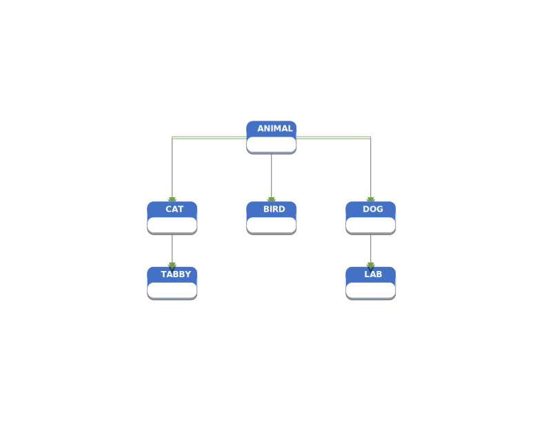

# Polymorphism

> What is polymorphism? If you Google it, you will get some esoteric definition about many-shapes or many-forms, but we need more than the etymology of word to make practicle use of the word. Polymorphism is substituting a base class say `Animal` for a subclass `Cat`. This subtitution allows one `type` to have many shapes: `Cat`, `Dog`, `Bird` etc. I do not know if you caught that I slipped in the word `type`. You see programming is all about types and mappings of types either from a type to itself or from a type to a different type. There are other principles of Programming like state, scope concurrency etc. But those will other posts for the future. The type **`int`** can have only one shape. By this I mean it has a pre-defined size and range of values. That is to say when the compiler reads a declaration of type **`int`** it knows that an **`int`** has only one size in memory, and if the value assigned to the declaration is valid. There is no guessing. So if **`int`** is a type and it can only have one form, it must be static. It cannot change. So types are not polymorphic. But what if we created a type `Whole Number` that sat under the type **`int`** in the type hierarchy. Polymorphism would let us substitute an instance of `Whole Number` where ever **`int`** was present. 

> But what is a hierarchy? And what do they have to do with Polymorphism? As you can see below in the graphic a hierarchy exemplifies a base type; here the base type is `object`. This is common in programming languages. But underneath `object` there are other `types`. These types are called derived types because they are derived from `object`. Lets take a look at an example. 



#### Given two C# classes
```csharp
public interface IAnimal
{

}


public class Animal : IAnimal
{
    public string? Name { get; set; }
    public string? Color { get; set; }

    protected Animal(string name, string color)
    {
        Name = name;
        Color = color;
    }
}

public class Cat : Animal
{
    public string Sound { get; set; }

    public Cat(string name, string color, string sound) : base(name, color)
    {
        Sound = sound;
    }
}

public class Dog : Animal
{
    public string Sound { get; set; }

    public Dog(string name, string color, string sound) : base(name, color)
    {
        Sound = sound;
    }
}
```

#### Then in the Program.cs
```csharp
var cat = new Cat("Jack", "Black", "Meow");
var dog = new Dog("TRex", "White", "Ruff");
GetAnimalName(cat); // "Jack"
GetAnimalName(dog); // Trex

void GetAnimalName(Animal animal)
{
    Console.WriteLine(animal.Name);
}
```

> Notice that `GetAnimalName`'s signature excepted an type of `Animal`. But since `Cat` is also a type of `Animal` polymorphism allows us to substitute `Animal` with `Cat`. 